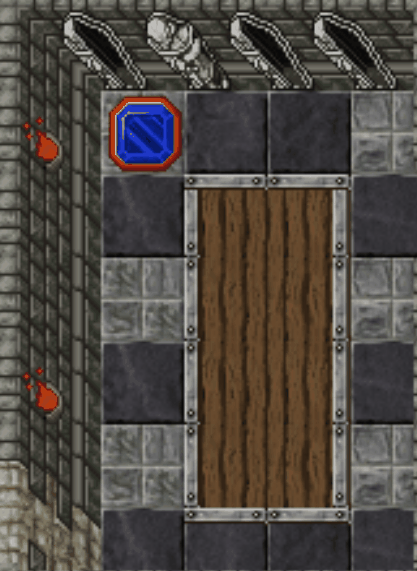
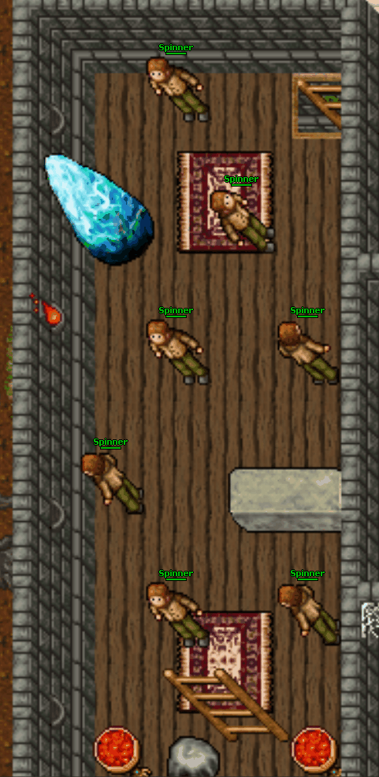

# Carlin Ghostlands Prison


* Level Required: 0
* Level recommended: 100+?
* Items Required: None

```
Completing this quest grant access to: Carlin Ghostlands Prison
```

Go find **A Sad Ghost** located west of Carlin in the Ghostlands.

<p align="center"></p>

He will ask you for your help in retrieving an item from the top of the house nearby.

<figure><figcaption></figcaption></figure>

Once inside you will have to navigate several puzzles that will teleport you back to the entrance if you fail.


The first puzzle involves you stepping on the blue squares while dodging the splash effects.

<figure><figcaption></figcaption></figure>

The second puzzle requires you to change all the floor tiles to green before running out of turns.

<figure><figcaption></figcaption></figure>

The third puzzle requires you to find the correct path through, and find a way past A Sleepy Djinn.

<div><figure><figcaption></figcaption></figure> <figure><figcaption></figcaption></figure></div>

The fourth and final puzzle requires you to make your way past the Spinners without one of them looking at you.

<figure><figcaption></figcaption></figure>

Once you make it to the room, don't get blinded by greed! Make sure you find the object you came here for hidden under some floorboards!

<figure><figcaption></figcaption></figure>

After obtaining the charm, A Sad Ghost will ask you to collect different colored masks from the Massive Skeletons in the graveyard and he will tell you a secret.

<figure><figcaption></figcaption></figure>


More info in the future!
