# Retro Quest 1

**THIS QUEST REQUIRES TWO PEOPLE FOR THE START.**

**Level Required:** 8 to start, 80\~ to finish, recommended 100+

**Rewards:** 2 [Points of Interest](../points-of-interest.md), Upgrade Crystal, Rarity Upgrade Crystal, Retro Greatsword

**Location:** Thais, Ankrahmun

**Monsters:** Trolls/Orcs, Retro Demons, Retro Great Spiders, Retro Dragons

* Head out the East Thais gate, to the nearby Troll Spawn.

<figure>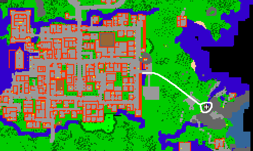<figcaption></figcaption></figure>

* Go east once inside.

<figure>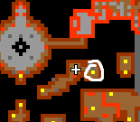<figcaption></figcaption></figure>

* East again.

<figure>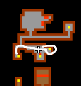<figcaption></figcaption></figure>

* North West, up the ladder.

<figure>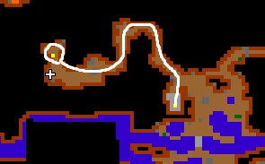<figcaption></figcaption></figure>

* Levitate up at this spot.

<figure><figcaption></figcaption></figure>

<figure>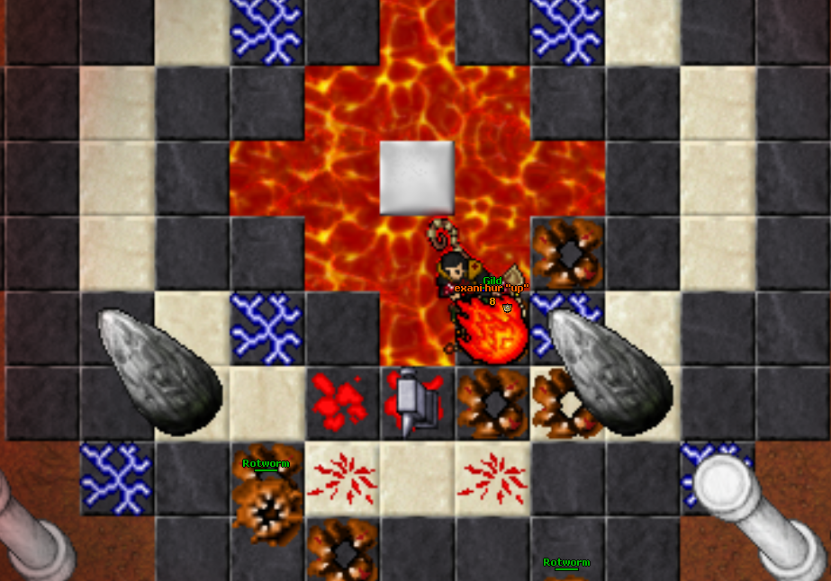<figcaption></figcaption></figure>

* On the north side of the room, have a person stand on the tile between two pillars.

<figure>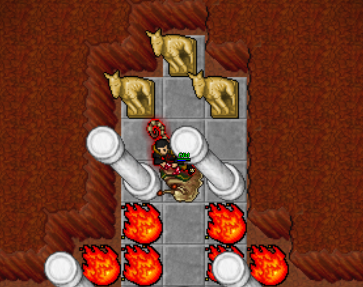<figcaption></figcaption></figure>

* When the tile in the Thais Trolls is stood on, some rocks in the Ankrahmun to Port Hope mountain passage are removed.

<figure><figcaption></figcaption></figure>

<figure><figcaption></figcaption></figure>

<figure><figcaption></figcaption></figure>

* Head south down the side path, and levitate down the ledge to obtain the Wooden Doll and a POI.

<figure><figcaption></figcaption></figure>

<figure>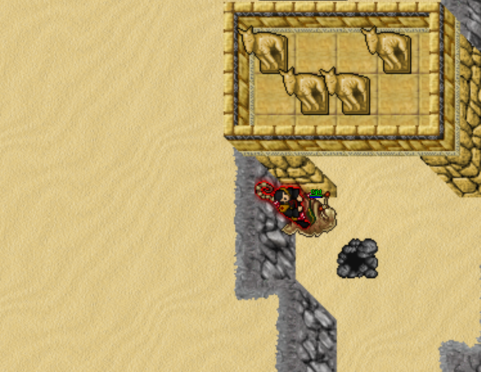<figcaption></figcaption></figure>

<figure>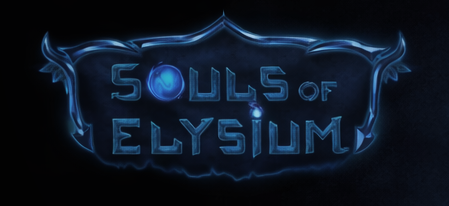<figcaption></figcaption></figure>

* Head back to the Thais Game Room, go downstairs to the Tic Tac Toe board.

<figure><figcaption></figcaption></figure>

* Place the Wooden Doll in the center of the board to open the wall. Inside is a POI and a Minotaur Skull.

<figure><figcaption></figcaption></figure>

NEXT STEPS REQUIRE TRAVELING TO MINTWALLIN!

* Head to Mintwallin.

<figure>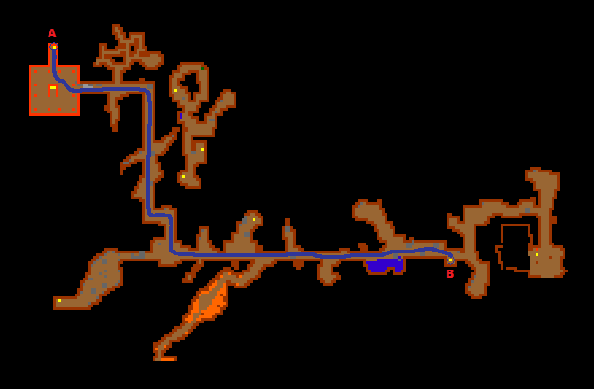<figcaption></figcaption></figure>

<figure>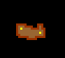<figcaption></figcaption></figure>

<figure>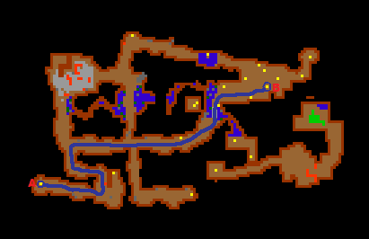<figcaption></figcaption></figure>

<figure><figcaption></figcaption></figure>

<figure>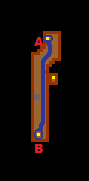<figcaption></figcaption></figure>

<figure><figcaption></figcaption></figure>

<figure><figcaption></figcaption></figure>

* Once in Mintwallin, head to the Castle and obtain the Silver Key, 3605.

<figure>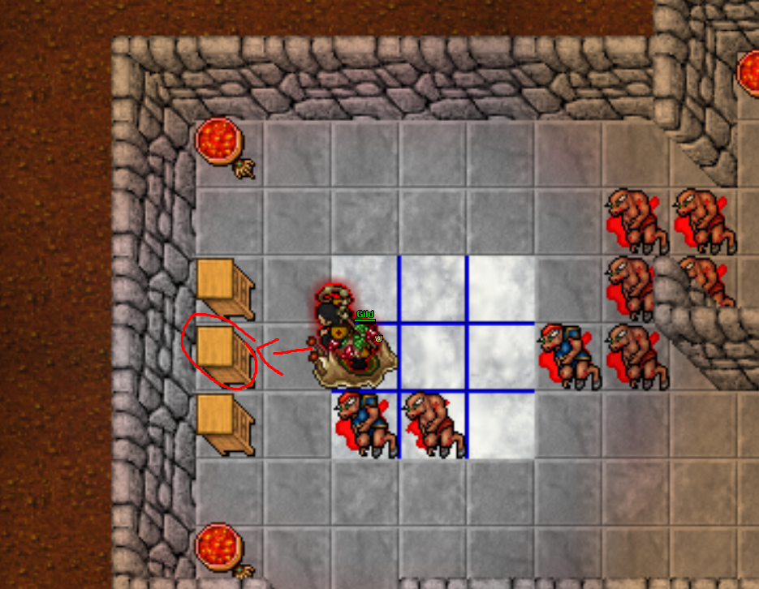<figcaption></figcaption></figure>

* Go up the stairs in the castle, head south and open the door with the key.

<figure><figcaption></figcaption></figure>

<figure><figcaption></figcaption></figure>

* Flip the lever to make the drawbridge appear.

<figure><figcaption></figcaption></figure>

* Head south around the path to the Grave Stone.

<figure><figcaption></figcaption></figure>

* Using the Minotaur Skull on the Grave Stone teleports you to the Retro Area, there is a portal to return as well! 

<figure><figcaption></figcaption></figure>

<figure><figcaption></figcaption></figure>

From here, there's 2 paths you need. The west path is more difficult, the east is easier. We'll do east first.

* Head east.

<figure><figcaption></figcaption></figure>

<figure><figcaption></figcaption></figure>

* Continue to follow the path and head UP the stairs.

<figure><figcaption></figcaption></figure>

* Follow the path to the lever and pull it.

<figure><figcaption></figcaption></figure>

<figure><figcaption></figcaption></figure>

* Head back, go down the stairs you passed earlier.

<figure><figcaption></figcaption></figure>

* Head west across the room and up the stairs.

<figure><figcaption></figcaption></figure>

* Pull the lever by the letter, initiating the Giant Spider Trap.

<figure><figcaption>
 
</figcaption></figure>

* Head west and pull the lever on the west side of this room as well.

<figure><figcaption></figcaption></figure>

* You can now go back down the stairs.

<figure><figcaption></figcaption></figure>

* Head back to the start, where you warped in.

* West Path features Demons, Green and Red Dragons, and Ancient Giant Spiders.

<figure><figcaption></figcaption></figure>

<figure><figcaption></figcaption></figure>

<figure><figcaption></figcaption></figure>

* Continue to follow the path down to enter the room surrounded by lava.

<figure><figcaption></figcaption></figure>

* Pulling this lever causes monsters to spawn all inside of the area to the South.

<figure><figcaption></figcaption></figure>

* Clear monsters to the south, and then the east to reach the portal.

<figure>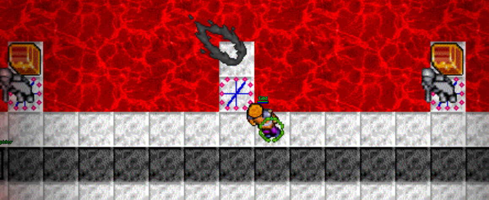<figcaption></figcaption></figure>

* Grab the Ancient Backpack and the Upgrade Crystal from the chests before entering the next portal.

<figure><figcaption></figcaption></figure>

* Entering the portal takes you back to the start of the Retro Quest. There's still more rewards to be had so continue reading!
* Head back to the portal room, this time heading through the South Portal.
* CAUTION, LARGE AMOUNT OF DANGEROUS CREATURES!

<figure><figcaption></figcaption></figure>

* This is a safe spot, going beyond this is dangerous!

<figure><figcaption></figcaption></figure>

<figure><figcaption></figcaption></figure>

* On the west side of the room at the end is Two Chests as well as one on the Northern Side.

<figure><figcaption></figcaption></figure>

<figure><figcaption></figcaption></figure>

* Head East out of the portal!

The End
