# Boss Tasks

Boss Tasks

* In addition to [Grizzly Tasks](grizzly-tasks.md) there are Bosses unlocked from killing monsters.
* These tasks are not associated with any NPC and are tracked automatically.
* Completing a Boss Task unlocks a boss that is accessed by a teleport. The location of the teleports are different for each creature.
* Some Boss Tasks unlock new areas and secrets.
* They can be repeated any number of times.

***

#### Amazons 

<figure><figcaption></figcaption></figure>

**Creatures:** Amazon, Valkyrie\
**Amount:** 300\
**Location:** Venore

Directions

<figure>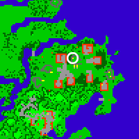<figcaption></figcaption></figure>

<figure><figcaption></figcaption></figure>

<figure><figcaption></figcaption></figure>

***

#### Crocodiles 

<figure><figcaption></figcaption></figure>

**Creatures:** Crocodiles\
**Amount:** 300\
**Location:** Port Hope

Directions

<figure>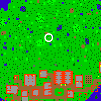<figcaption></figcaption></figure>

<figure>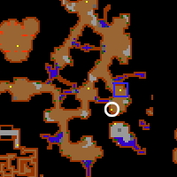<figcaption></figcaption></figure>

***

**Crystal Spider**

<figure><figcaption></figcaption></figure>

**Creatures:** Crystal Spider\
**Amount:** 300\
**Location:** Svargrond, Northwest of City in the Mountain

Directions

<figure>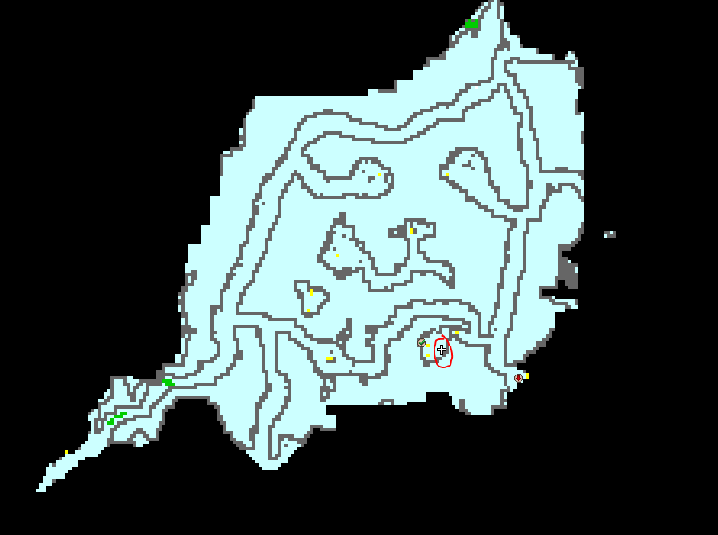<figcaption></figcaption></figure>

***

#### Minotaur Mages 

<figure><figcaption></figcaption></figure>

**Creatures:** Minotaur Mages\
**Amount:** 300\
**Location:** Darashia

Directions

<figure>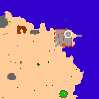<figcaption></figcaption></figure>

<figure>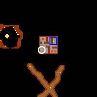<figcaption></figcaption></figure>

<figure>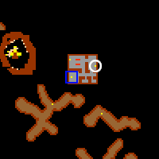<figcaption></figcaption></figure>

<figure>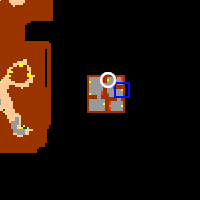<figcaption></figcaption></figure>

<figure><figcaption></figcaption></figure>

<figure>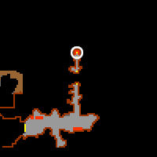<figcaption></figcaption></figure>

***

#### Tarantulas 

<figure><figcaption></figcaption></figure>

**Creatures:** Tarantulas\
**Amount:** 300\
**Location:** Port Hope, Directly South of Banuta

Directions

<figure>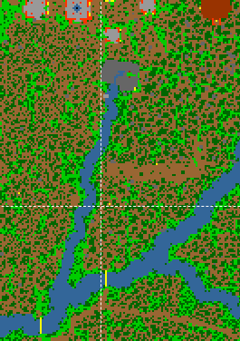<figcaption></figcaption></figure>

<figure>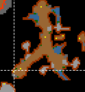<figcaption></figcaption></figure>

***

#### Mutated Rats 

<figure><figcaption></figcaption></figure>

**Creatures:** Mutated Rats\
**Amount:** 250\
**Location:** Carlin Mini-Yalahar

Directions

<figure>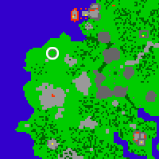<figcaption></figcaption></figure>

<figure>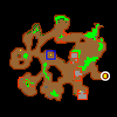<figcaption></figcaption></figure>

<figure>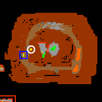<figcaption></figcaption></figure>

<figure><figcaption></figcaption></figure>

<figure><figcaption></figcaption></figure>

***

#### Wyverns 

<figure><figcaption></figcaption></figure>

**Creatures:** Wyverns\
**Amount:** 100\
**Location:** Edron, East of Boat Passage, Top Floor (Mountain)

Directions

Top floor of Wyvern Mountain in northern Edron.

***

#### Giant Spiders 

<figure><figcaption></figcaption></figure>

**Creatures:** Giant Spiders\
**Amount:** 600\
**Location:** Plains of Havoc 

***

#### Slave Hunters 

**Creatures:** Slave Hunters\
**Amount:** 200\
**Location:** Ankrahmun, northwest of northwest gate (inside the spawn (house) 

***

#### Fire Spirits 

<figure><figcaption></figcaption></figure>

(shows up as “Fire Spirits Absorbed”)\
**Creatures:** Fire Devils, Fire Elementals\
**Amount:** 300\
**Location:** Thais 

***

#### Water Elementals 

**Creatures:** Water Elementals\
**Amount:** 400\
**Location:** Port Hope, Water Elemental Cave

Directions

<figure>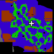<figcaption></figcaption></figure>

***

#### Dragon Lords 

<figure><figcaption></figcaption></figure>

**Creatures:** Dragon Lords\
**Amount:** 1000\
**Location:** Venore, West of POH Temple

Directions

<figure><figcaption></figcaption></figure>

***

#### Hydras 

<figure><figcaption></figcaption></figure>

**Creatures:** Hydras\
**Amount:** 900\
**Location:** Port Hope, Just East of North Hydra Spawn

Directions

<figure>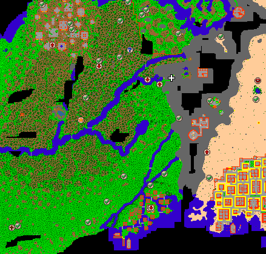<figcaption></figcaption></figure>

***

#### Sea Serpents 

<figure><figcaption></figcaption></figure>

**Creatures:** Sea Serpents\
**Amount:** 900\
**Location:** Svargrond, North Spawn in the Center -2

Directions

<figure>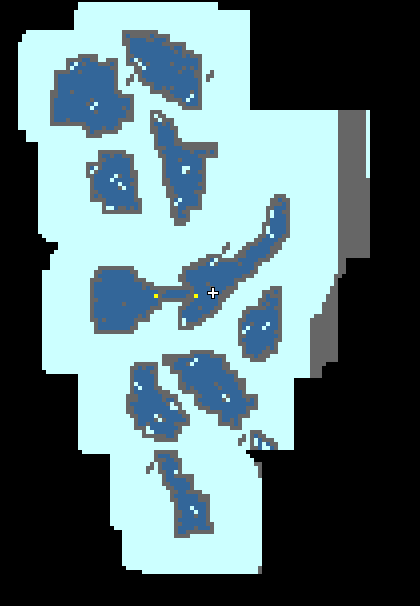<figcaption></figcaption></figure>

***

#### Serpent Spawn 

**Creatures:** Serpent Spawns\
**Amount:** 1000\
**Location:** Port Hope, Banuta

Directions

<figure>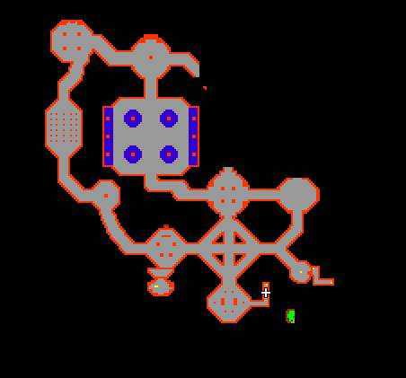<figcaption></figcaption></figure>

***

#### Behemoths 

<figure><figcaption></figcaption></figure>

**Creatures:** Behemoths\
**Amount:** 800\
**Location:** Edron Behemoth Cave

Directions

<figure>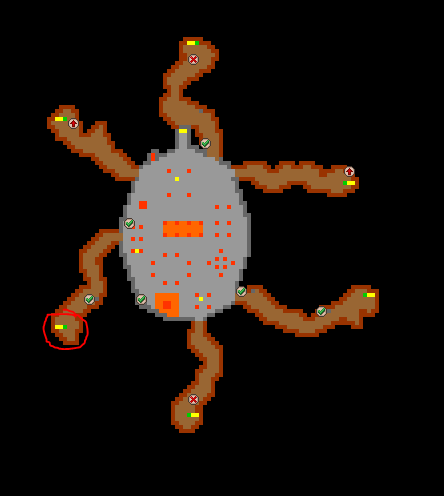<figcaption></figcaption></figure>

***

#### Warlocks & Infernalists 

<figure><figcaption></figcaption></figure>

**Creatures:** Warlocks & Infernalists\
**Amount:** 400\
**Location:** Demona 

***

***

#### Demons 

Orshabaal

**Creatures:** Demons\
**Amount:** 1500\
**Location:** Edron

Directions

Demon Helmet quest area

***

#### Grand Warlocks 

Keraunos

Location: Endless Dungeon

***

**Tempest Dragons**

Unknown Name&#x20;

Location: Narnia Frost Mountains

Directions

<figure><figcaption></figcaption></figure>

**Red Wizard (Kaz Dungeon Boss)**

Diabolic Sorceror&#x20;

Location: Demona

Directions

<figure><figcaption></figcaption></figure>

<figure><figcaption></figcaption></figure>

<figure><figcaption></figcaption></figure>

<figure><figcaption></figcaption></figure>

<figure><figcaption></figcaption></figure>

<figure><figcaption></figcaption></figure>

